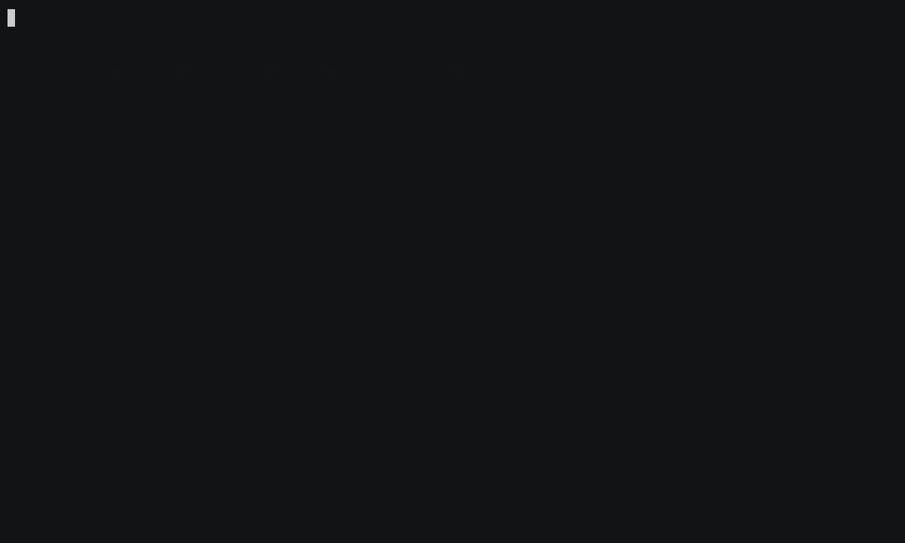

# baglens

**Robot recording integrity, with published precision and recall — and a verdict of
`unassessable` when it cannot tell.**

Existing rosbag tools let you *open a bag*. `baglens` audits whether the recording can be
trusted at all, tells an agent in writing what the data cannot support, remembers your
whole corpus, and answers the question that matters when something breaks: **has this
happened before?**

Two things here are unusual enough to state up front. Every detector's accuracy is
measured against labels this project did not write — including on real recordings, where
the honest number is **0.824 recall**, not the 1.000 the synthetic corpus reports. And
when too little of a recording can be measured, it returns `unassessable` with reasons
instead of a score, because a tool that is never confidently wrong is worth more than one
that always has an answer.

Here it is on a public PX4 flight, deciding that a magnetometer outage was not the
magnetometer — 105 topics went silent together, so the recorder stalled:


Every figure in that recording is real and reproducible: `scripts/demo.py` drives the
same `call_tool` entrypoint an MCP client uses, against
[flight `588ff157`](https://review.px4.io) from review.px4.io. The audit genuinely takes
~20s on 845k messages; only the silent wait is compressed in playback. The other two
demos — [refusing to grade an unmeasurable recording](#it-refuses) and
[gating a training set](#the-training-data-gate) — are further down, and are recorded the
same way.

The shape of a full report:

```
> Audit ~/data/mission_204.mcap before I draw any conclusions from it.

  verdict: usable_with_caveats (score 77.5/100)

  CRITICAL  system-wide stall: 4 topics silent together for 5.19s at t=41.8s
  HIGH      /camera/image_raw silent for 5.19s (156x its 30.0 Hz period)
  MEDIUM    /imu/data is missing ~516 messages (5.7% of expected)

  caveats:
    - /camera/image_raw was silent between t=41.8–47.0s; do not compute rates,
      counts, or coverage over that window.
    - At least one silence was system-wide, so it reflects the recording host
      rather than any sensor; do not attribute those windows to a subsystem.

  /camera/image_raw |▓▓▓▓▓▓▓▓▓▓▓▓▓▓▓▓▓▓▓▓▓▓▓▓▓▓▓▓▓█▓▓▓▓▓▓▓▓▓▓▓▓     ▓▓▓▓▓▓▓▓▓▓▓▓▓▓█▓▓▓▓▓▓▓▓▓▓▓▓▓▓|
  /imu/data         |█▓▓▓▓▓▓▓▓▓▓▓▓▓▓▓▓▓▓▓▓▓▓▓█▓▓▓▓▓▓▓▓▓▓▓▓█▓▓▓▓    ·▓█▓▓▓▓█▓▓▓█▓▓▓▓▓█▓█▓▓▓▓▓▓▓▓▓|
  /odom             |▓▓▓▓▓▓▓▓▓▓▓▓▓▓▓▓▓▓▓▓▓▓▓▓▓▓█▓▓▓▓▓▓▓▓▓▓▓█▓▓▓    ·▓▓▓▓▓▓▓▓▓▓▓▓▓▓▓▓▓▓▓▓▓▓▓▓▓▓▓▓|
  /scan             |▓▓▓▓▓▓▓▓▓▓▓▓▓▓▓▓▓▓▓▓▓▓▓▓█▓▓▓▓▓▓▓▓▓▓▓▓█▓▓▓▒    ·▓▓▓▓▓▓▓▓▓▓▓▓▓▓▓▓▓▓▓▓▓▓▓▓▓█▓▓|
```

That last block is `health.topic_timeline`: four topics dying at the same instant, which
is the difference between "the camera failed" and "the recorder stalled". It costs about
300 tokens.

---

## Install

```bash
uvx --from git+https://github.com/ahmedsleem109/Baglens baglens --stdio
```

No ROS installation required. `.mcap`, rosbag2 `.db3`, ROS 1 `.bag` and PX4 `.ulg` are
read in pure Python, and all four are covered by an end-to-end test asserting they reach
identical conclusions on the same recording. `.ulg` needs the `ulog` extra
(`uv sync --extra ulog`).

**Tested on other people's robots, not only on our own fixtures.** 105 public PX4 flights
from review.px4.io ([`REAL_DATA.md`](evals/integrity/REAL_DATA.md)) and 11 real ROS 2
recordings across 5 platforms — an autonomous shuttle bus, a Tesla Model 3, a quadruped, a
short-run rig and a handheld LiDAR rig ([`ROS2_DATA.md`](evals/integrity/ROS2_DATA.md)).
`scripts/fetch_ros2.sh` downloads the ROS 2 set so anyone can re-run it.

## Why this exists

| Project | What it does | Where it stops |
|---|---|---|
| `binabik-ai/mcp-rosbags` | Reads `.bag`, `.db3`, `.mcap`; message querying, trajectories, TF | One bag at a time; no persistent index; no cross-mission reasoning |
| `rosbags-mcp` + MCP Lab UI | Pulls data from bags, plots with Plotly | Per-file; plotting-oriented rather than investigation-oriented |
| ROSBag MCP Server (arXiv 2511.03497) | Academic; trajectories, laser scans, transforms; benchmarks 8 LLMs | Research release; mobile-robotics scoped; single-bag |
| `ros-mcp-server` / RobotMCP | **Live** robot control — publish to topics, call services | Not a log-analysis tool; the opposite direction |
| Foxglove | Best-in-class visualisation and data management | Human-in-the-loop GUI, not an agent tool surface |
| **baglens** | Integrity auditing, a durable fleet catalog, cross-mission comparison, provenance on every claim | Not a visualiser, not a robot controller, not a cloud platform |

The gap this fills: **nothing tells you your data is wrong.** `rosbag2` drops messages
under load — users report frame loss well below disk throughput limits — and you find
out three weeks later, mid-investigation. `baglens` finds it in the first thirty seconds
and tells the agent, in writing, what conclusions the recording cannot support.

## What it detects

Eight detectors, all single-pass with bounded state, measured against 200 synthetic
recordings with injected, labelled faults (160 faulted + 40 clean controls):

| Detector | What it catches | Precision | Recall | FP per clean bag |
|---|---|---|---|---|
| `gap` | A topic goes silent | 1.000 | 1.000 | 0.000 |
| `rate_degradation` | A topic slowly *slows down* — the precursor nothing else looks for | 1.000 | 1.000 | 0.000 |
| `jitter` | Timing variance widens before rates change | 1.000 | 1.000 | 0.000 |
| `dropped` | Messages missing, clustered or diffuse | 1.000 | 1.000 | 0.000 |
| `clock_lag` | The recorder falling behind the publishers | 1.000 | 1.000 | 0.000 |
| `clock_step` | NTP corrections and backward time | 1.000 | 1.000 | 0.000 |
| `correlation` | Sensor failure vs. system-wide stall | 1.000 | 1.000 | 0.000 |
| `file_integrity` | Truncated, unindexed and in-progress files | 1.000 | 1.000 | 0.000 |

Reproduce with `uv run python -m evals.integrity.run --regenerate`. Full method and the
matching rules are in [`evals/integrity/RESULTS.md`](evals/integrity/RESULTS.md).

**Read that table with the appropriate scepticism.** These are synthetic faults from a
generator in this repository. Perfect scores mean the detectors and the generator agree
about what a fault looks like — they are a regression gate and a floor, not evidence of
field accuracy.

### The same detectors, same faults, on real recordings

Here is what those eight perfect scores are worth once the *background* is real. The same
fault shapes are injected into copies of real `ros2 bag record` files, which keep the
robot's own jitter, burstiness, topic mix and QoS — only the fault is ours, and we know
exactly where we put it ([`INJECTED.md`](evals/integrity/INJECTED.md)):

| Corpus | Background | Labels | Recall | Precision |
|---|---|---|---|---|
| Synthetic fault matrix | generated | 200 bags | 1.000 | 1.000 |
| **Injected into real recordings** | **real** | **34 exact** | **0.824** | **1.000** |
| PX4 dropout records | real | 152, not ours | 0.993 | 0.955 |

**A real background costs 18 points of recall, and that is the number worth publishing.**
Scoring is differential: every base recording is also copied clean and audited, so a
finding the clean copy already had is attributed to the recording rather than to the
injected fault — otherwise the number measures the recording's health, not the detector's
accuracy. Five of the six misses are on one recording: a shuttle bus parked for its entire
run, which the tool now declines to grade at all (see below).

This proves injected faults are caught against a real background. It does not prove every
naturally-occurring fault is — injection can only produce shapes someone thought of. That
is one rung above a synthetic corpus and one rung below an instrumented robot, and it is
stated that way in the eval rather than rounded up.

### The same detectors on real flights, against labels we did not write

PX4's logger writes a dropout record into the `.ulg` whenever it could not keep up. That
is ground truth authored by the flight controller, on hardware nobody here has touched.
Scored against it across **105 distinct public flights** from review.px4.io — 677 minutes,
152 labelled dropouts:

| | Recall | Precision | F1 |
|---|---|---|---|
| `correlation` vs. PX4's own dropout records | **0.993** | **0.955** | 0.974 |

**151 of the 152 dropouts the recorder admitted to were found.** The one miss is not a
detection failure but a *bounded-state* one: the detector keeps at most 1000 silent
intervals, and on the busiest flight in the corpus one real stall is evicted. Streaming
with fixed memory is the constraint the whole library is built on, so that trade is
deliberate and stated rather than quietly relaxed.

This table read `0.381` until the false positives were split by class and looked at, and
the history is the point. `correlation` makes two different claims — `system-wide stall`
("the recorder stopped") and `subsystem failure` ("a shared driver died") — and the eval
was scoring both against dropout labels, which are evidence for the first and silent
about the second. Splitting them showed the stall claim was already at 0.954 while the
subsystem claim sat at 0.071, and that 236 of the 242 unmatched findings came from one
defect: a topic counted as "co-silent" whenever it merely had not published recently. A
1 Hz topic is idle across any 0.4 s window by construction, so short gaps on event-driven
topics collected a dozen innocent bystanders each. Topics too slow to have been due
within an interval now leave both the numerator and the denominator, and the corpus went
from 391 findings to 156. The per-class split is in
[`evals/integrity/FP_SPLIT.md`](evals/integrity/FP_SPLIT.md).

What did **not** work is worth as much. Making this detector honour `unassessable` — the
flag that already stops D2 and the per-topic scores judging event-driven topics — looks
like the obvious next fix and was tried four ways. Every one of them cost 22+ points of
recall against real labels, because when the recorder stops, event-driven topics stop too
and their silence is evidence exactly like anyone else's. The measurements are in
[`PHASE3.md`](PHASE3.md).

Before that, an earlier version read `0.832` across twelve flights — the flights
`audit_corpus.py` had ranked most interesting, which is a selection effect. Running the
identical eval over all 105 moved it to 0.381 with recall unchanged. The detector did not
get worse; the measurement got honest. **Any number measured on a subset that something
selected should be assumed flattering until re-run on everything.**

What this means in practice: **a stall finding's recall is the stronger claim.** If
`correlation` says the recording was clean, believe it. If it reports a stall, the
co-silent topic list is the evidence to check — that is why every finding carries one.
Method, per-flight breakdown, and what this does *not* measure are in
[`evals/integrity/REAL_DATA.md`](evals/integrity/REAL_DATA.md).

**What real data broke, and what fixed it.** The first run against those flights graded
every single one `compromised`, at 47–56/100, with 900–3000 findings each — against a
0.000 false-positive rate on synthetic bags. The detections were right; the *reporting*
was wrong, in two ways:

- **One stall was reported once per topic.** When the recorder stops, all ~115 topics go
  silent together. That is one event, and it now produces one finding with the co-silent
  topics as evidence — not 115 findings plus a dropped-message bill for every topic that
  was never given the chance to publish.
- **Topics with no cadence were measured against one anyway.** Event-driven topics
  (`/home_position` with 5 messages, `/event` arriving in bursts) had a rate learned from
  burst spacing — up to 2700× their real rate. Each then scored zero and set the
  `min()` that dominates the overall score. They are now reported as unassessable, with
  the reason, and excluded from the score rather than deciding it.

On a 25-flight sample that moves the distribution from **0 trustworthy / 0 usable / 25
compromised** to **4 / 12 / 9**, with the median finding count down from ~1000 to ~40.
The nine still graded `compromised` lost a mean **31.5%** of their recording time to
stalls, against 2.3% for the rest — the verdict now tracks damage rather than topic count.
All eight detectors stay at 1.000/1.000 on the synthetic gate, so none of this was bought
by detecting less.

## The health score, in the open

```
topic_score = 100 · (1 − 0.30·gap_penalty − 0.35·drop_rate
                         − 0.20·jitter_excess − 0.15·degradation)

overall     = (0.5·min(scores) + 0.3·mean(scores) + 0.2·file_score)
              · (1 − 2.5·stalled_fraction)

              where `scores` covers only topics we can actually assess

≥85 trustworthy   ·   60–85 usable with caveats   ·   <60 compromised

                     unassessable — a refusal to grade, overriding all of the above
```

### It refuses

`unassessable` is not a worse grade than `compromised`; it is the tool declining to
answer. Four floors, each reported when it is the one that failed: too few topics with a
measurable rate, too little of the traffic on those topics, too little of the wall clock
covered, or too short to establish a baseline at all.

This exists because of one recording. An autonomous shuttle bus, parked for its entire
1,492-second run, 70 of whose 110 topics are event-driven, was published as `compromised`
at score **0.0** — a confident, precise, completely wrong judgement about a recording where
**0 of 70 topics have a measurable publication rate.** Fixing the detector that produced
the false alarm was necessary and, on its own, made it worse: the same file then read
*trustworthy at 98.7*, because a recording nothing can be measured in produces few
findings, and few findings look exactly like a clean recording.

Both recordings below are the same shuttle bus, audited by the same tool in the same run —
one driving a route, one parked. It grades the first and declines to grade the second:



That comparison is the whole point. A refusal only means something if the same tool
confidently grades the recording next to it; a tool that refuses everything is not
cautious, it is useless.

Anyone can emit findings. What is worth owning is a tool that is never confidently wrong.

Weighting the *minimum* heavily is deliberate: one broken critical topic compromises an
investigation regardless of how healthy the other forty are. `gap_penalty` is measured
against 5% of the recording's length, so five missing seconds matter in a two-minute run
and not in an eight-hour one.

Two terms exist because of what real flights did to the first version of this formula:

- **`stalled_fraction`** is the share of the recording lost to system-wide stalls, and it
  is charged **once**, here. `gap_penalty` deliberately ignores that silence, because
  charging every topic for the same stall punished a 115-topic vehicle 115 times for one
  event.
- **Topics we cannot assess are excluded, not scored.** A topic that never completed
  warmup, or whose modal rate exceeds the rate it ever sustained by 5×, has no rate model
  to be measured against. They are listed with `hz_source: "aperiodic"` and a reason —
  letting a 5-message event topic set a `min()` weighted at 0.5 was, on its own, most of
  why every real recording read as `compromised`.

Every constant lives in `config.py` and is overridable.

## The streaming constraint

Every detector is an **online algorithm with bounded state**. No detector buffers the
recording, needs the end time, or makes a second pass:

- statistics come from Welford and EWMA, never `numpy.mean` over an accumulated array;
- thresholds adapt from a warmup window, never from global file statistics;
- gap lists, lag curves and density timelines are all fixed-size, with truncation
  reported rather than hidden.

That costs perhaps 20% more effort and buys two things: 50 GB files audit without being
loaded, and the same code runs unchanged against a live subscription.

**The per-topic bound is only a bound under `BAGLENS_EDGE_PROFILE=1`, and that is now
gated in CI.** The default profile keeps up to 1000 gaps per topic on purpose, so one
gappy topic can hold 48 KB — a workstation trade, not a device budget. Measured on a real
118-topic PX4 flight: 7,360 B on the worst topic by default, **2,016 B under the edge
profile**, which is where the "<2 KB per topic" claim lives.

## Performance, measured

On real recordings, not synthetic ones (WSL2, single thread):

| Metric | 66 MB PX4 `.ulg`, 118 topics | 886 MB ROS 2 MCAP, 4 topics |
|---|---|---|
| Arrival scan (payload-free) | 205,000 msg/s · 16 MB/s | 21,000 msg/s · 766 MB/s |
| Full audit, all 8 detectors | 44,500 msg/s · 3.5 MB/s | 13,800 msg/s · 501 MB/s |
| Peak RSS | 257 MB | 39 MB |
| State per topic (edge profile) | 2,016 B | 1,984 B |

Two caveats a reader should have, rather than a round number:

- **The 257 MB is the reader, not the detectors.** `pyulog` parses an entire ULog into
  numpy before the first arrival is seen. The detectors themselves hold under 1 MB of it,
  and the streaming formats stay at 39 MB regardless of file size. The bounded-state
  claim is about the detectors and it holds; the ULog *reader* is not streaming.
- **A live snapshot costs more than the audit.** Snapshotting at 1 Hz on a 2.7 kHz stream
  roughly doubles the run — the previously published "~14%" was wrong. One snapshot is
  ~80 ms on a 311 s flight (down from 162 ms), and it is `finish()`, not serialisation,
  that dominates. Measure your own cadence with `scripts/bench_snapshot.py`.

MB/s is dominated by *message count*, not bytes: the audit never parses payloads, so a
bag full of camera frames audits far faster per megabyte than these tiny synthetic
messages do. The original 500 MB/s target in the design notes was written before
measurement and is not achievable in pure Python at this message rate — `scripts/bench.py`
asserts the real numbers instead.

## Tool surface

43 tools across 10 namespaces — see [`docs/tool-reference.md`](docs/tool-reference.md).

| Namespace | Purpose |
|---|---|
| `health.*` | Audit a recording, find gaps, clock report, QoS report, timeline, validate, explain |
| `inspect.*` | Topics, schemas, samples, field statistics |
| `timeseries.*` | Extract, anomalies, changepoints, correlation, window comparison |
| `catalog.*` | Register sources, index, list, search, tag, fleet summary |
| `compare.*` | Mission diff, cohorts, find similar, regression scan, ranking |
| `logs.*` | Query, pattern clustering, merged timeline, log/signal correlation |
| `spatial.*` | Trajectory summary, deviation, TF tree health |
| `frames.*` · `pointcloud.*` | Keyframes, contact sheets, lidar statistics |
| `export.*` | Trim bag, Plotly HTML, Foxglove layout, cited Markdown report |

Design rules, enforced by a contract test that discovers new tools automatically:
every result is a typed model, carries provenance, and respects a token budget.

**Tool-surface eval:** 56 cases, 100% pass rate, 0.67% uncited claims, 773 tokens per
case on average — [`evals/RESULTS.md`](evals/RESULTS.md).

## The training-data gate

```bash
baglens gate ~/data/episodes --out manifest.json \
    --require /observation/joint_states,/action --max-gap 0.5
```

Nobody minds a 4% lossy debug bag. A training set is different, because the harm is silent
and delayed: an imitation-learning pipeline assumes its streams are aligned, so when the
recorder stalls for 200 ms nothing errors — the action at *t* is simply paired with an
observation from *t−200 ms*, and the model learns that. You find out weeks later, in
evaluation, having already paid for the run.

So the output is not a score. It is a manifest: accept / review / reject per episode, a
reason code and a human reason for every rejection, and a `train_on` list a training job
reads directly.


"`/sbg/ekf_nav` was silent for 15.01s in one stretch" is actionable. "Score 61" is not.

That run is 14 episodes: nine real recordings left alone, and five copies with a known
fault injected — so the rejections above are verifiable rather than merely plausible.
Reproduce it with `scripts/demo_gate.py`.

**Scope, stated rather than implied.** This reads recordings with real timestamps. It does
**not** audit LeRobot-format datasets: those recompute per-frame timestamps as
`frame_index / fps` during conversion — measured across `lerobot/pusht` and
`lerobot/aloha_static_coffee`, inter-frame deltas vary only by float rounding (~1e-6 s) —
so the timing evidence these detectors read is already gone by then. Gate the recordings,
then convert.

## Configuration

<details>
<summary>Claude Desktop on Windows, server in WSL</summary>

```json
{
  "mcpServers": {
    "baglens": {
      "command": "wsl.exe",
      "args": ["-d", "Ubuntu", "--cd", "/home/YOU/dev/baglens",
               "--", "/home/YOU/.local/bin/uv", "run", "baglens", "--stdio"],
      "env": {}
    }
  }
}
```

Use the **absolute path** to `uv`: WSL non-login shells often lack `~/.local/bin` on
`PATH`, and that failure is silent and maddening.
</details>

<details>
<summary>Claude Code / Cursor / native Linux and macOS</summary>

```json
{
  "mcpServers": {
    "baglens": {
      "command": "uvx",
      "args": ["--from", "git+https://github.com/ahmedsleem109/Baglens",
               "baglens", "--stdio", "--root", "/home/YOU/data"]
    }
  }
}
```
</details>

Ready-made copies live in [`examples/`](examples/).

| Flag / env | Effect |
|---|---|
| `--root DIR` (repeatable) | Confine all reads under DIR; traversal outside is refused |
| `--sensitivity low\|normal\|high` | Scales gap and trend thresholds for your fleet's noise floor |
| `--no-frames` | Disables all image extraction outright |
| `--http --port 8765` | Streamable HTTP instead of stdio |
| `BAGLENS_MAX_TOKENS` | Per-tool response budget (default 4000) |
| `BAGLENS_EDGE_PROFILE=1` | Shrink detector state under 2 KB/topic |
| `BAGLENS_REDACT_TOPICS` | Comma-separated topics dropped before results leave a tool (`/camera/*` matches a prefix) |
| `BAGLENS_REDACT_FIELDS` | Comma-separated `field.path` or `/topic:field.path` rules; masked in payloads *and* refused through `field_stats` and `timeseries.extract` |

## Privacy and safety posture

- **Local-first, zero telemetry.** Nothing leaves your machine.
- **Read-only by construction.** The only writer in the codebase is `export.trim_bag`,
  and it only ever creates a new file.
- **Root confinement** and **config-driven redaction** applied before results leave the
  tool boundary, so masked fields never reach the model.

## Non-goals

- **Not a visualiser.** Foxglove exists and is better; `export.foxglove_layout` hands off.
- **Not a robot controller.** Read-only, offline, forensic.
- **Not a cloud platform.** No account, no upload, no telemetry.
- **Not a storage format.** MCAP won. Consume it.

## Development

```bash
git clone https://github.com/ahmedsleem109/Baglens && cd baglens
uv sync
uv run pytest -q                                    # 115 tests
uv run python -m tests.synth.generate --matrix --out /tmp/bags
uv run python -m evals.integrity.run --bags /tmp/bags    # precision/recall
uv run python -m evals.runner                            # tool-surface eval
uv run python scripts/bench.py                           # performance gates
```

Docs: [quickstart (WSL)](docs/quickstart-wsl.md) · [tool reference](docs/tool-reference.md) ·
[recipes](docs/recipes.md) · [design notes](docs/design-notes.md)

Apache-2.0.
